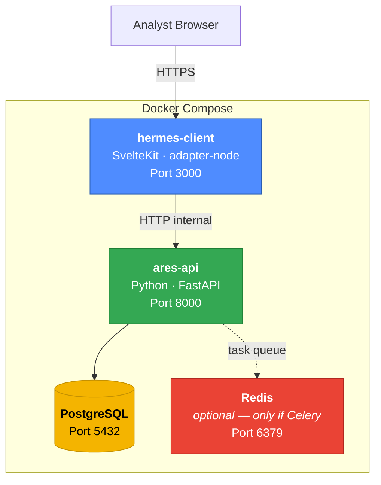
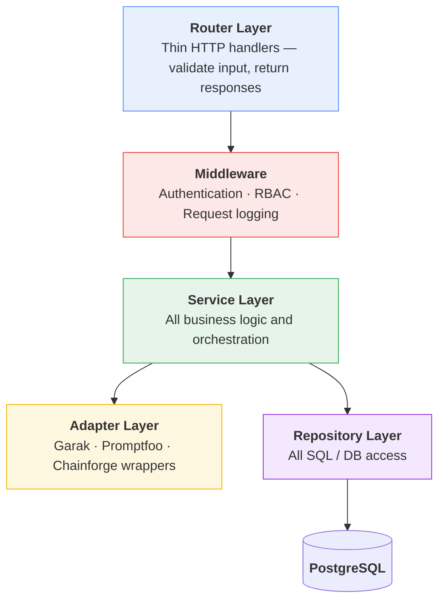
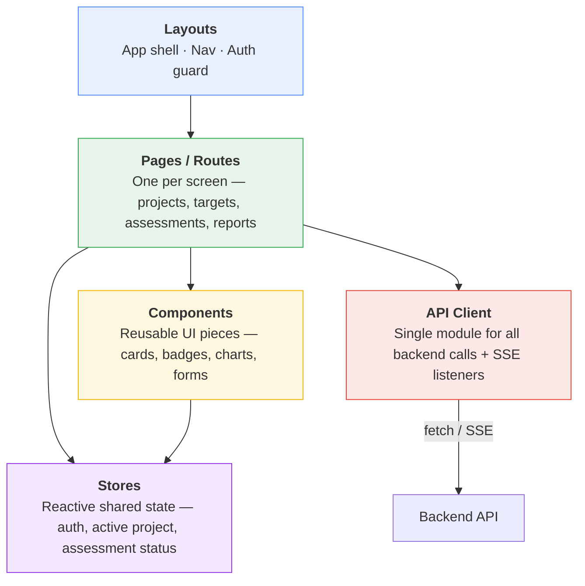
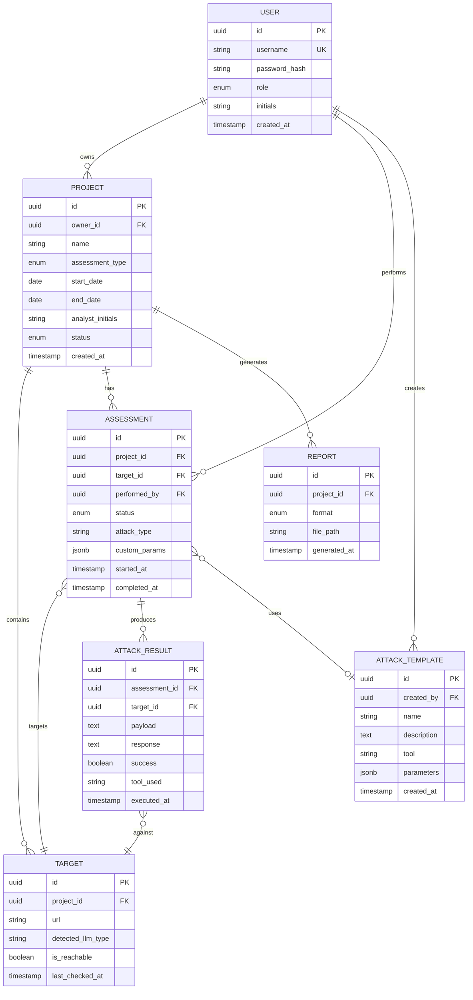
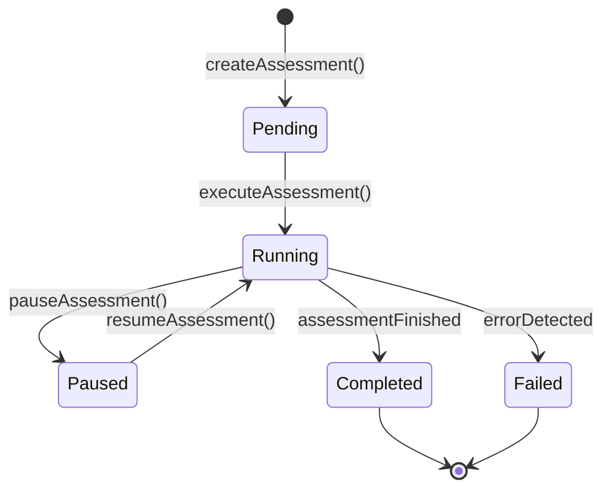
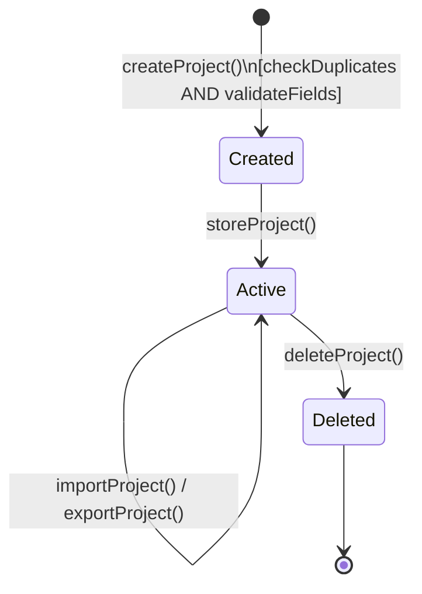
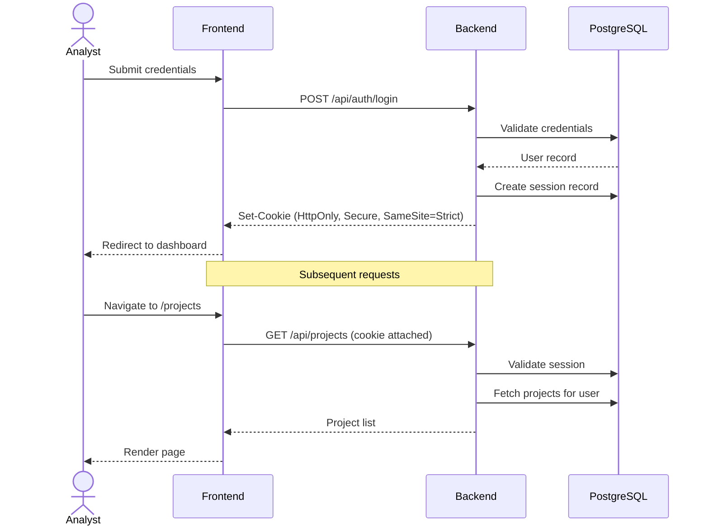
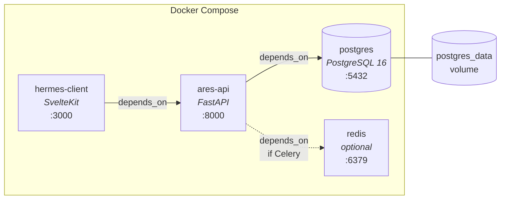

# PromptStrike — Technical Architecture Overview

**Team 11 (TrailDev) | CS 4310 Software Engineering | UTEP**
**Document Owner:** Joel Martinez, Design Manager
**Date:** March 11, 2026

---

## Abstract

PromptStrike is a web-based cybersecurity platform for the Transformation and Decision Analysis Center (TDAC) that enables analysts to test Large Language Models for prompt injection vulnerabilities. The system is split across two independently deployable repositories, each named after a figure from Greek mythology reflecting its role in the architecture.

**hermes-client** — *The Messenger*
The frontend application, built with SvelteKit. Hermes was the messenger of the gods — this layer is the analyst's interface to the system, responsible for presenting data, capturing input, and relaying information between the user and the backend. It renders dashboards, visualizations, real-time attack progress, and exportable reports.

GitHub: `https://github.com/Escanor4323/promptStrike-hermes-client.git`

**ares-api** — *The God of War*
The backend API and attack orchestration engine, built with Python and FastAPI. Ares was the god of war — this layer handles all offensive operations: orchestrating Garak, Promptfoo, and Chainforge against target LLMs, managing assessment lifecycles, enforcing authentication and RBAC, and persisting all data to PostgreSQL.

GitHub: `https://github.com/Escanor4323/promptStrike-ares-api.git`

Both repositories are containerized via Docker and composed together with PostgreSQL (and optionally Redis) through a shared `docker-compose.yml` for single-command deployment on Kali Linux.

---

## 1. Mandated Tech Stack (from RDD)

| Layer | Technology | RDD Req |
|-------|-----------|---------|
| Frontend | **SvelteKit** | #13 |
| Backend | **Python** | #12 |
| Database | **PostgreSQL** | Client-directed |
| Containerization | **Docker + Docker Compose** (health checks, self-healing) | #10 |
| Target OS | **Kali Linux** (latest ≤ 05/31/26) | #18 |
| Licensing | All FOSS — no paid licensing | #9 |
| Network | Must function fully offline (air-gapped) | #17c |
| Hardware floor | 8 GB RAM, 4-core 2.0 GHz, 10 GB storage | #15 |
| Library currency | No dependency unmaintained > 1 year | #19 |
| Compliance | STIG CAT I — Application Security & Development, per NIST 800-53 | #16 |

### 1.1 Recommended Stack Fills (team discretion)

| Concern | Recommendation | Rationale |
|---------|---------------|-----------|
| Python framework | **FastAPI** | Async-native, auto-generates OpenAPI spec, lightweight. Flask is the safe fallback but lacks native async. |
| ORM / DB access | **SQLAlchemy 2.0 + Alembic** | Mature, well-documented, Alembic handles schema migrations. Async support via `asyncpg`. |
| SvelteKit adapter | **adapter-node** | Produces a standalone Node server for Docker. `adapter-static` won't work — we need SSR for auth redirects. |
| CSS framework | **Tailwind CSS** or **Skeleton UI** | Utility-first, no paid license, fast to prototype. |
| PDF export | **WeasyPrint** | HTML-to-PDF in Python. FOSS, no headless browser needed. |
| Real-time updates | **Server-Sent Events (SSE)** | Simpler than WebSockets for one-way streams (attack progress → UI). Upgrade to WebSocket only if bidirectional control is needed. |
| Task runner | **Celery + Redis** or **asyncio in-process** | Attacks are long-running. Celery is proven. If the team wants zero extra services, `asyncio.create_task` works for a single-instance deployment but doesn't survive restarts. |

---

## 2. System Architecture

### 2.1 Container Topology

### 2.2 Backend Layered Architecture

**Layer rules:**

- **Routers** never contain business logic. They parse the request, call a service, and format the response.
- **Services** never write raw SQL or know about HTTP status codes. They operate on domain models and raise domain exceptions.
- **Repositories** are the only layer that touches the database. One repository per aggregate root.
- **Adapters** normalize external tool interfaces behind a common contract. The service layer doesn't know whether it's talking to Garak's CLI or Promptfoo's REST API.
- **Middleware** handles cross-cutting concerns (auth, RBAC, logging) before the request reaches a router.

### 2.3 Frontend Structure

**Frontend responsibilities:** All UI rendering, client-side form validation (duplicated on backend), SSE listeners for live attack progress, chart/visualization rendering, CSV upload handling.

**NOT in the frontend:** Business logic, direct DB queries, attack orchestration, any secrets beyond session cookies.

---

## 3. Minimum Required Data Models

### 3.1 Entity Relationship Diagram

### 3.2 Model Definitions

**USER** — An authenticated person using PromptStrike. Represents the TDAC analyst or administrator.

- `role` enum values: to be confirmed by client (see Open Questions). At minimum: `analyst`. Potentially: `admin`, `team_lead`.
- `password_hash`: stored using bcrypt or argon2 — never plaintext (STIG CAT I requirement).
- `initials`: carried into project metadata per RDD (assessment records include analyst initials).

**PROJECT** — A container for a single assessment engagement. Groups targets, assessments, and reports under one umbrella with metadata required by the RDD.

- `assessment_type` enum values: `CVI`, `CVPA` — per RDD typical use case. Exact behavioral difference TBD (see Open Questions).
- `status` enum values: `created`, `active`, `archived`, `deleted` — governs whether the project appears in the selection menu and whether it's exportable.

**TARGET** — A single LLM endpoint URL discovered or manually entered by the analyst.

- `detected_llm_type`: the human-readable LLM name (e.g., "ChatGPT", "LLaMA") auto-detected via HTML analysis per RDD Req #5. Nullable — detection may fail on raw API endpoints.
- `is_reachable`: result of the last connectivity check. Updated on ingestion and on-demand.

**ASSESSMENT** — A single attack run against a specific target. This is the core operational entity — it tracks the lifecycle from configuration through execution to completion.

- `status` enum values: `pending`, `running`, `paused`, `completed`, `failed` — maps directly to the Execute Assessment STD.
- `attack_type`: identifies which category of attack (e.g., prompt injection, jailbreak). Exact taxonomy depends on the external tools' capabilities.
- `custom_params`: JSONB blob for tool-specific configuration the analyst provides at launch time. Schema varies by tool.
- One assessment targets one target. To attack multiple targets, the analyst creates multiple assessments (keeps results cleanly separated per RDD reporting requirements).

**ATTACK_RESULT** — A single prompt-response pair produced during an assessment. The atomic unit of data for reporting.

- `payload`: the exact prompt or input sent to the target LLM.
- `response`: the LLM's reply.
- `success`: whether this particular attempt achieved exploitation (true/false).
- `tool_used`: which external tool generated this result — `garak`, `promptfoo`, or `chainforge`.

**ATTACK_TEMPLATE** — A reusable, analyst-defined attack configuration. Per RDD Req #3 under Exploitation Tools: analysts should be able to develop custom attack templates.

- `tool`: which adapter this template is designed for.
- `parameters`: JSONB blob containing the template's configuration (prompt patterns, iteration counts, model parameters, etc.).

**REPORT** — A generated export artifact for a project. Per RDD, reports must be exportable as PDF and HTML.

- `format` enum values: `pdf`, `html`.
- `file_path`: location of the generated file on disk (within the Docker volume).
- Report content is assembled at generation time from project, assessment, and attack_result data — it is not stored redundantly.

### 3.3 Required Report Content (from RDD)

Every generated report must include:

- Generation timestamp on each page
- Full project metadata (name, type, start date, end date, analyst initials)
- Visualization of total LLMs assessed
- Visualization of total attacks launched — successful vs. failed
- All payloads used in successful attacks

---

## 4. Assessment Lifecycle (State Model)

This maps directly to the `ASSESSMENT.status` enum and the Execute Assessment STD from the design artifacts.

---

## 5. Project Lifecycle (State Model)

Projects in `Active` state can be imported into, exported from, and have assessments run against them. Deletion is a terminal state.

---

## 6. Sessions & RBAC

### 6.1 Session Management

**Approach:** Server-side sessions with HTTP-only cookies.

Server-side sessions are preferred over JWTs for this system because it's a single-instance deployment on Kali Linux — sessions are simpler, immediately revocable, and don't require token refresh logic. The session record lives in PostgreSQL (no extra infra) or Redis (if already present for Celery).

**Session flow (conceptual):**

**Key session properties:**

- Session ID: cryptographically random, opaque token
- Cookie flags: `HttpOnly`, `Secure`, `SameSite=Strict`, `Path=/`
- Expiration: configurable idle timeout (STIG requirement — sessions must expire after inactivity)
- Revocation: delete the session record on logout; sweep expired records periodically

### 6.2 RBAC

**The RDD describes one actor: "Analyst."** It does not define an admin role. However, the system needs at minimum a way to create the first user and manage accounts.

**Proposed roles (needs client confirmation):**

| Role | Scope |
|------|-------|
| **admin** | Full system access. User management. View all projects. |
| **team_lead** | View all projects within their scope. Cannot manage users. |
| **analyst** | CRUD own projects. Run assessments. Generate reports. Cannot see other analysts' projects unless shared. |

**Enforcement points:**

- **Middleware (role-level):** Checks whether the user's role meets the minimum required for the route. A blunt gate — "is this user at least a team_lead?"
- **Service layer (resource-level):** Checks whether the user owns or has access to the specific resource. "Does this analyst own this project?" This is where ownership logic lives — not in middleware.

---

## 7. Naming Conventions

### 7.1 Backend (Python) — snake_case

| Element | Convention | Example |
|---------|-----------|---------|
| Files & modules | `snake_case.py` | `project_service.py` |
| Functions & methods | `snake_case` | `create_project()` |
| Variables | `snake_case` | `attack_result` |
| Classes | `PascalCase` | `ProjectService` |
| Constants | `UPPER_SNAKE_CASE` | `MAX_RETRIES` |
| API route paths | `kebab-case` | `/api/v1/attack-templates` |
| DB table names | `snake_case`, plural | `attack_results` |
| DB column names | `snake_case` | `created_at` |
| Environment variables | `UPPER_SNAKE_CASE` | `DATABASE_URL` |

### 7.2 Frontend (SvelteKit / TypeScript) — camelCase

| Element | Convention | Example |
|---------|-----------|---------|
| Component files | `PascalCase.svelte` | `AttackCard.svelte` |
| Route files | SvelteKit convention | `+page.svelte` |
| TS utility files | `camelCase.ts` | `apiClient.ts` |
| Functions & variables | `camelCase` | `fetchProjects()` |
| Constants | `UPPER_SNAKE_CASE` | `API_BASE_URL` |
| Types & interfaces | `PascalCase` | `AssessmentStatus` |
| Svelte stores | `camelCase` | `projectStore` |

### 7.3 Cross-Boundary Contract (JSON over HTTP)

Backend sends **snake_case** JSON (Python-idiomatic). The frontend API client layer transforms to **camelCase** at the boundary. One transform function, one location, no ambiguity.

### 7.4 Docker

| Element | Convention | Example |
|---------|-----------|---------|
| Service names | `kebab-case` | `ares-api`, `hermes-client` |
| Volume names | `snake_case` | `postgres_data` |
| Image tags | `semver` | `ares-api:0.1.0` |

---

## 8. Design Patterns

### 8.1 Backend

| Pattern | Where | Purpose |
|---------|-------|---------|
| **Repository** | DB access layer | Isolates all SQL from business logic. Services never write queries. Enables testing with mock repos. |
| **Service Layer** | Business logic | Single place for domain rules and orchestration. Routers stay thin. |
| **Adapter** | External tool integration | Normalizes Garak, Promptfoo, and Chainforge behind a common interface. Service layer doesn't know which tool it's talking to. |
| **Dependency Injection** | FastAPI's `Depends()` | DB sessions, current user, and services are injected — no global state. |
| **Factory** | Tool adapter selection | Given a tool name from the assessment config, returns the correct adapter instance. |

### 8.2 Frontend

| Pattern | Where | Purpose |
|---------|-------|---------|
| **Stores** | Shared reactive state | Auth state, active project, and live assessment status available to any component without prop drilling. |
| **Layout Auth Guard** | Root app layout | The layout's server-side load function validates the session. Invalid → redirect to login. All child routes are protected automatically. |
| **Server-Side Load** | `+page.server.ts` files | Data fetching happens on the SvelteKit server, not in the browser. API keys and session logic never reach the client. |

---

## 9. STIG CAT I Implications

The RDD requires zero CAT I vulnerabilities per the Application Security and Development STIG. These are the architectural implications — not a full checklist, but the items that shape design decisions:

| Concern | Implication |
|---------|-------------|
| Authentication | No anonymous access to any functional route |
| Session timeout | Sessions must expire after configurable inactivity period |
| Password storage | Bcrypt or argon2 only — never plaintext or reversible |
| Input validation | All user input validated server-side; reject unexpected types and lengths |
| Error handling | No stack traces or internal details exposed to the client in production |
| Transport security | TLS required (self-signed acceptable for local Docker dev) |
| No hardcoded secrets | All credentials and keys via environment variables |
| Audit logging | Security-relevant events (login, failed auth, data modification) must be logged |

---

## 10. Open Questions

Ordered by impact. The first group blocks architecture decisions.

### 10.1 Blocking (before Sprint 1 code)

1. **RBAC scope:** Does the client expect multiple roles (admin, team_lead, analyst), or is every user an analyst with equal access?

2. **User bootstrapping:** Who creates user accounts? Self-registration, admin-created, or seeded via setup script?

3. **External tool integration model:** Garak, Promptfoo, and Chainforge have very different interfaces (CLI, Node.js, Python, web app). Does the client expect subprocess calls, co-deployed Docker services, or Python library imports? The RDD says "API connection" but that term doesn't map cleanly to all three tools.

4. **Offline vs. tool dependencies:** If the system must work air-gapped, all three tools and their transitive dependencies must be bundled in Docker images. Has the client confirmed these tools function fully offline?

### 10.2 Important (before mid-sprint)

5. **CVI vs. CVPA:** What is the functional difference between these assessment types? Does it change available attacks, report format, or just metadata?

6. **Custom attack template flexibility:** Can analysts write arbitrary prompts, or is this a parameterized form (select category → fill variables)?

7. **Real-time results granularity:** During an attack, what streams to the UI? Per-prompt results? Aggregate success rate updating live? Both?

8. **Topology map meaning:** Is this a literal network topology (routers, switches, endpoints) or a logical map of discovered LLM endpoints grouped by host?

9. **Multi-analyst concurrency:** Can two analysts attack the same target simultaneously? How does reporting handle overlap?

### 10.3 Clarification (before implementation)

10. **Project import/export format:** JSON? ZIP archive? Not specified in RDD.

11. **LLM detection fallback:** "Detect via HTML analysis" — what happens when a target has no web UI (raw API endpoint)? Is manual classification acceptable?

12. **Report regeneration:** Does regenerating a report replace or archive the previous version?

13. **Hardware floor testing:** Will the team have access to an 8 GB / 4-core machine, or do we simulate via Docker resource limits?

---

## 11. Preliminary Docker Compose Topology

All services include health checks and `restart: unless-stopped` per RDD Req #10.

---

## 12. Completeness Checklist

This document is ready for Sprint 1 when:

- [ ] All blocking questions (Section 10.1) have client answers
- [ ] Team has reviewed and agreed on naming conventions
- [ ] Docker Compose runs with all services healthy on Kali Linux
- [ ] At least one end-to-end flow works: login → create project → list projects
- [ ] STIG CAT I items mapped to specific implementation decisions